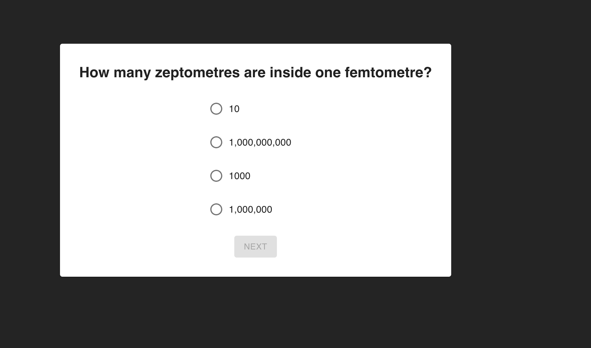
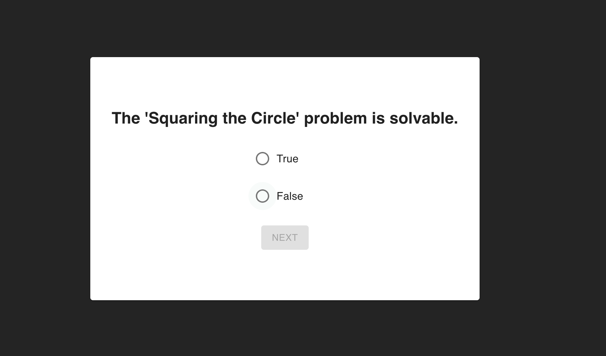
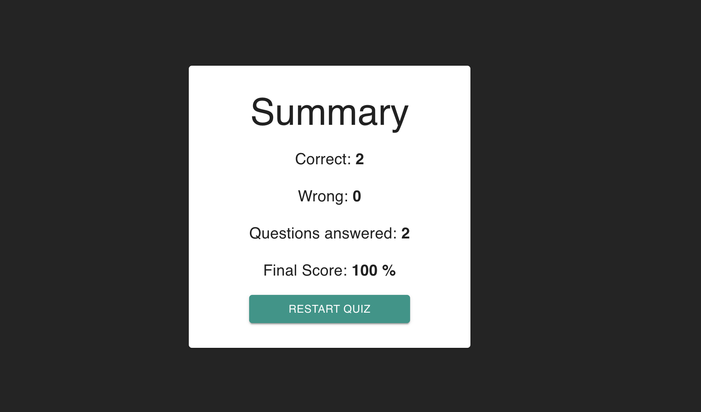

# Quiz App

UI that shows a set of questions and lets the user select an answer for each one. Hexagonal Architecture + React + Typescript + MaterialUI.

## Getting Started

1. Install dependencies by running: 
```bash
pnpm install
# or
yarn install
# or
npm install
# or
```

2. Run the development server with:

```bash
pnpm dev
# or
yarn dev
# or
npm run dev
```





## Tests
```bash
pnpm test
# or
yarn test
# or
npm run test
```

## Deployed on Vercel
https://quiz-app-sage-eta.vercel.app/
